<h1 align="center">Live PCA Engine — Interactive Spatial 3D Visualization</h1>

<p align="center">
  <strong>An interactive, real-time 3D visualization system that transforms abstract linear algebra into a tangible spatial phenomenon driven by physical hand gestures.</strong>
</p>

<p align="center">
  <a href="#overview">Overview</a> •
  <a href="#tech-stack">Tech Stack</a> •
  <a href="#system-architecture">Architecture</a> •
  <a href="#key-capabilities">Key Capabilities</a> •
  <a href="#interaction-pipeline">Interaction Pipeline</a> •
  <a href="#mathematical-foundation">Mathematical Foundation</a> •
  <a href="#project-structure">Project Structure</a> •
  <a href="#cross-platform-installation">Installation</a> •
  <a href="#controls-cheat-sheet">Controls</a> •
  <a href="#performance--benchmarking">Performance</a> •
  <a href="#documentation">Documentation</a> •
  <a href="#verification">Verification</a>
</p>

---

## Overview

Principal Component Analysis (PCA) is one of the most foundational concepts in data science, statistics, and machine learning. Yet for decades, it has been taught almost exclusively through static two-dimensional projections, covariance formulas on whiteboards, and black-box `fit_transform()` calls in Python notebooks. This classical approach leaves students and practitioners with a mathematical understanding of eigendecomposition, but little intuition for the physical reality of variance, orthogonal bases, and dimensional collapse.

**Live PCA Engine** reimagines the learning experience as **Physical Linear Algebra**.

Instead of viewing static charts, a presenter stands in front of a standard webcam and reaches directly into a floating 3D Gaussian point cloud. Using natural physical hand gestures, the presenter can orbit around the distribution like a tangible sphere, inspect the emerging orthogonal eigenvector basis, and physically press down on the axis of smallest variance. As the presenter pushes their hand toward the camera, 3D points physically travel along continuous mathematical trajectories toward an optimal 2D projection subspace, flattening the data distribution into a razor-thin slice in real time.

The engine enforces strict mathematical truth over decorative effects: every point coordinate, arrow length, bounding plane, and projection path represents an exact closed-form linear algebra computation executed live on your machine.

---

## Tech Stack

<p align="center">
  <sub>CORE MATH & COMPUTING</sub><br />
  
  
  
  
  <br /><br />
  <sub>COMPUTER VISION & TRACKING</sub><br />
  
  
  <br /><br />
  <sub>3D SPATIAL GRAPHICS</sub><br />
  
  
  
  <br /><br />
  <sub>TESTING & PORTABILITY</sub><br />
  
  
  
</p>

---

## System Architecture

The Live PCA Engine is designed around a multi-threaded, asynchronous dual-loop model that decouples slow camera I/O and neural network inference from high-frequency 3D scene rendering:

```mermaid
graph LR
    subgraph Thread1 ["Thread 1: Asynchronous Input Pipeline"]
        A["Webcam Capture<br/>720p @ 30 FPS"] --> B["MediaPipe Hand Tracking<br/>256x256 Square ROI"]
        B --> C["Landmark Smoother<br/>EMA Filter (alpha=0.3)"]
        C --> D["Input Snapshot<br/>Thread-Safe Bridge"]
    end

    subgraph Thread2 ["Thread 2: Main Engine Loop (Panda3D)"]
        D --> E["Gesture Intent Gating<br/>Ratchet / Clutch Check"]
        D --> F["Math Core Engine<br/>Covariance & eigh"]
        
        E --> G["State & Physics Manager<br/>Trackball + SVD Ortho"]
        F --> H["Continuous Projection Math<br/>p_i(c) Homotopy & Extents"]
        
        G --> I["Scene Graph Assembly<br/>GPU Sprites + Depth Bins"]
        H --> I
    end

    subgraph Outputs ["Dual Live Viewports"]
        I --> J["3D Spatial Viewport<br/>Panda3D (Locked 60 FPS)"]
        B -.-> K["Hand Tracking HUD<br/>OpenCV Overlay Window"]
        G -.-> K
    end

    style A fill:#12131C,stroke:#38BDF8,stroke-width:2px,color:#fff
    style B fill:#12131C,stroke:#A855F7,stroke-width:2px,color:#fff
    style C fill:#12131C,stroke:#0EA5E9,stroke-width:2px,color:#fff
    style D fill:#12131C,stroke:#6366F1,stroke-width:2px,color:#fff
    style E fill:#12131C,stroke:#EC4899,stroke-width:2px,color:#fff
    style F fill:#12131C,stroke:#10B981,stroke-width:2px,color:#fff
    style G fill:#12131C,stroke:#F59E0B,stroke-width:2px,color:#fff
    style H fill:#12131C,stroke:#10B981,stroke-width:2px,color:#fff
    style I fill:#12131C,stroke:#8B5CF6,stroke-width:2px,color:#fff
    style J fill:#12131C,stroke:#38BDF8,stroke-width:2px,color:#fff
    style K fill:#12131C,stroke:#F43F5E,stroke-width:2px,color:#fff
```



<div align="center">

```text
                                ┌────────────────────────┐
                                │ Gesture Intent Gating  │────────┐
                                │   (Ratchet / Clutch)   │        │
                                └───────────▲────────────┘        │
                                            │                     ▼
┌──────────────┐     ┌──────────────┐       │              ┌──────────────┐     ┌────────────────┐
│Webcam Capture│────►│  MediaPipe   │       │              │ Scene Graph  │────►│   Panda3D 3D   │
│  (Thread 1)  │     │Hand Landmarker───────┼─────────────►│   Assembly   │     │Spatial Viewport│
└──────────────┘     └──────────────┘       │              └──────▲───────┘     └────────────────┘
                                            │                     │
                                            ▼                     │
                                ┌────────────────────────┐        │
                                │ Math Core & Projection │────────┘
                                │    (Covariance, eigh)  │
                                └────────────────────────┘
```

</div>

### Execution Lifecycle

1. **Thread 1 (Input Pipeline):** Captures 720p frames from OpenCV, pads them into a 256x256 square to prevent MediaPipe C++ segmentation faults, computes 21 3D landmarks, and applies Exponential Moving Average smoothing.
2. **The Atomic Bridge:** Packages processed tracking data into an immutable, frozen `InputSnapshot` dataclass and swaps it behind a non-blocking thread lock.
3. **Thread 2 (Top Parallel Track — Gesture & Physics):** Evaluates hand orientation via 2D cross-product. If the clutch is engaged, hand deltas are converted into angular momentum for a world-space trackball matrix, stabilized continuously via Singular Value Decomposition.
4. **Thread 2 (Bottom Parallel Track — Math Engine):** Computes empirical covariance, performs symmetric eigendecomposition via `np.linalg.eigh`, enforces deterministic sign conventions, and evaluates continuous point positions along projection trajectories.
5. **Scene Graph Convergence:** Both parallel streams converge at the scene graph. Point cloud GPU vertex buffers, eigenvector arrows, wireframe bounding box, and projection planes are synchronized in hardware.
6. **Dual Live Display:** The final rendered scene displays in the Panda3D window at a locked 60 FPS, while a synchronized secondary OpenCV window displays tracking confidence, skeleton connections, and mode badges.

---

## Key Capabilities

### Physical Hand Tracking & Isolated Chirality
Powered by Google's MediaPipe Tasks API v1.0.1 running on a dedicated background thread. The engine applies an aspect-ratio padding transform that maps widescreen camera frames into a 256x256 square neural network tensor, permanently eliminating internal C++ ROI-tracking segmentation faults. Tracking is explicitly locked to the presenter's physical right hand through selfie-mirror chirality inversion, completely ignoring background bystanders.

### Ratchet & Clutching Mechanism
Rotating a 3D object on a screen using continuous hand motion inevitably causes backward rotation when the hand resets. The engine features a mathematical clutching mechanism based on the 2D cross-product of the metacarpal hand bones. Rotation only engages when the back of the presenter's hand faces the camera. Flipping the hand to face the palm toward the camera instantly disengages the clutch, allowing the presenter to reposition their arm freely—functioning exactly like a mechanical ratchet wrench.

### Continuous Velocity-Driven Projection
Dimensionality compression is not a pre-rendered or time-based animation. It is parameterized as a continuous state variable $c \in [0, 1]$ driven strictly by hand velocity along the smallest principal axis. If the presenter freezes their hand, the transformation halts at that exact mathematical coordinate. If the hand reverses, projection reverses. Built-in magnetic extreme springs gently draw the state to $c = 0.0$ or $c = 1.0$ when the hand stops moving, ensuring clean tangent alignments.

### Hardware-Accelerated Spatial Rendering
The 3D environment is rendered via Panda3D using hardware point sprites with spherical falloff textures. Point positions are streamed directly into pre-allocated GPU vertex array buffers with zero heap allocation per frame. Dual directional key and fill lights are attached directly to the virtual camera node, ensuring the face of the point cloud remains vibrantly illuminated regardless of orbital perspective.

### Precision Depth Slicing
Cross-sectional visualization requires semi-transparent planes to interact correctly with solid points. Using Panda3D fixed render bins (Bin 10 for points, Bin 30 for the plane) combined with selective depth writes, points on the near side of the plane properly occlude it, points on the far side remain visible through the glass, and intersecting points create an exact planar cross-section.

---

## Interaction Pipeline

The application organizes interaction into four distinct, unambiguous operational modes to ensure presentations remain natural and glitch-free:

```text
[Space] IDLE / FREEZE --> Presentation pause. Disconnects hand tracking so you can speak freely.
[1]     ROTATION      --> World-space trackball manipulation using the Ratchet gesture.
[2]     ZOOM          --> Depth-based spatial scaling using rigid metacarpal bone distance.
[3]     COMPRESSION   --> Hand velocity pushes data along PC3 to collapse 3D into 2D.
```

### The Ratchet Gating Formula

When rotating a 3D distribution, resetting your hand back to center shouldn't undo the rotation. The engine solves this by checking hand chirality and orientation:

```text
User sees palm (back of hand to camera)     --> Cross_Z > 0 --> CLUTCH ENGAGED (Object Rotates)
User sees back of hand (palm to camera)     --> Cross_Z <= 0 --> CLUTCH DISENGAGED (Hand Resets)
```

$$\text{cross}_z = (\text{MCP}_5^x - \text{Wrist}_0^x)(\text{MCP}_{17}^y - \text{Wrist}_0^y) - (\text{MCP}_5^y - \text{Wrist}_0^y)(\text{MCP}_{17}^x - \text{Wrist}_0^x)$$

This allows a presenter to swipe repeatedly in one direction to spin the point cloud smoothly, turning their hand slightly to reset without touching the keyboard.

---

## Mathematical Foundation

All computations are implemented in pure vectorized NumPy within [`src/math_core/`](./src/math_core/).

### 1. Mean Centering & Covariance
Given dataset $\mathbf{X} \in \mathbb{R}^{N \times 3}$:

$$\boldsymbol{\mu} = \frac{1}{N} \sum_{i=1}^N \mathbf{x}_i, \qquad \mathbf{X}_c = \mathbf{X} - \mathbf{1}\boldsymbol{\mu}^T$$

$$\mathbf{C} = \frac{1}{N - 1} \mathbf{X}_c^T \mathbf{X}_c$$

### 2. Symmetric Eigendecomposition (`np.linalg.eigh`)
Because covariance is symmetric positive semi-definite, `eigh` guarantees strictly real eigenvalues and orthonormal eigenvectors:

$$\mathbf{C} \mathbf{v}_j = \lambda_j \mathbf{v}_j, \quad \text{with } \lambda_1 \ge \lambda_2 \ge \lambda_3 \ge 0, \quad \mathbf{V}^T \mathbf{V} = \mathbf{I}$$

### 3. Deterministic Sign Stabilization
To prevent eigenvectors from flipping $180^\circ$ across frames, we force the maximum absolute component of each column to be positive:

$$k = \arg\max_r |V_{rj}|, \qquad \text{if } V_{kj} < 0 \implies \mathbf{v}_j \leftarrow -\mathbf{v}_j$$

### 4. Mathematical PCA Bounding Box
Points are projected onto the principal basis $\mathbf{Z} = \mathbf{X}_c \mathbf{V}$. The box extents $\mathbf{L}$ and world-space center $\mathbf{c}_{world}$ are computed from exact projected extremes:

$$\mathbf{L} = \mathbf{z}_{max} - \mathbf{z}_{min}, \qquad \mathbf{c}_{world} = \boldsymbol{\mu} + \mathbf{V} \left( \frac{\mathbf{z}_{min} + \mathbf{z}_{max}}{2} \right)$$

### 5. Continuous Projection Homotopy
For a compression factor $c \in [0, 1]$ controlled by hand momentum, every point moves along an optimal linear path to the 2D subspace:

$$\mathbf{p}_i(c) = (1 - c)\mathbf{x}_i + c \left( \boldsymbol{\mu} + z_{i1}\mathbf{v}_1 + z_{i2}\mathbf{v}_2 \right) = \mathbf{x}_i - c \, z_{i3} \mathbf{v}_3$$

As $c \to 1.0$, the displacement along the third principal component $\mathbf{v}_3$ contracts to zero, the bounding box flattens, and variance perpendicular to the principal subspace vanishes.

---

## Project Structure

```text
live-pca-engine/
├── assets/
│   └── sphere.png                 # Hardware point sprite texture
├── docs/
│   ├── index.md                   # Complete documentation map & overview
│   ├── architecture.md            # Dual-loop threading & coordinate spaces
│   ├── math_engine.md             # Theoretical linear algebra breakdown
│   ├── interaction_and_gestures.md # Tracking, ratchet clutch, trackball
│   ├── rendering_and_compositing.md # Panda3D scene graph, depth buffers
│   └── quickstart_and_controls.md # Operator guide & controls reference
├── scripts/
│   └── validate_setup.py          # Pre-flight environment check script
├── src/
│   ├── app.py                     # Main application loop & event coordinator
│   ├── config.py                  # Immutable configuration dataclasses
│   ├── compositor/                # OpenCV frame blending & skeleton overlay
│   ├── input/                     # CameraCapture, MediaPipe tracker, smoother
│   ├── interaction/               # Gesture recognizer, ratchet, state manager
│   ├── math_core/                 # Data generator, PCA engine, box, projection
│   ├── performance/               # Latency profiler & real-time telemetry
│   └── renderer/                  # Panda3D scene graph & visual primitives
├── tests/                         # 14 test suites (30 unit & acceptance tests)
├── environment.yml                # Conda environment definition (live-pca)
├── requirements.txt               # Pip dependency requirements
├── pyproject.toml                 # Pytest configuration & project metadata
└── run_gpu.sh                     # Hybrid GPU launcher script for Linux
```

---

## Cross-Platform Installation

The application runs natively across **Windows**, **macOS**, and **Linux**. All core libraries (NumPy, SciPy, OpenCV, MediaPipe, Panda3D) provide official pre-compiled native binaries for all three operating systems.

### Prerequisites
* **Python:** 3.10 or 3.11 (Python 3.11 recommended)
* **Webcam:** Any standard USB or integrated laptop webcam (720p or 1080p)
* **Operating System:** Windows 10/11 (x64), macOS 12+ (Intel / Apple Silicon), or Linux (Ubuntu, Debian, Fedora, Arch)

### Option A: Using Conda (Recommended)

```bash
# Clone the repository
git clone https://github.com/AbdelazizElbanna/live-pca-engine.git
cd live-pca-engine

# Create and activate environment
conda env create -f environment.yml
conda activate live-pca
```

### Option B: Using Python Virtual Environment (venv)

```bash
python3 -m venv venv

# On Linux / macOS:
source venv/bin/activate

# On Windows (PowerShell):
# .\venv\Scripts\Activate.ps1

pip install --upgrade pip
pip install -r requirements.txt
```

### Pre-Flight Verification

Verify that your Python environment, webcam access, MediaPipe Tasks API, and Panda3D graphics context are operational:

```bash
python scripts/validate_setup.py
```

### Launching the Application

```bash
# Universal launch (Windows, macOS, Linux):
python main.py

# Optional launcher for Linux laptops with hybrid graphics (Intel + NVIDIA):
./run_gpu.sh
```

---

## Controls Cheat Sheet

All shortcuts can be executed from either the Panda3D 3D window or the OpenCV tracking window:

| Key / Input | Mode / Action | Behavior |
| :--- | :--- | :--- |
| **`[Space]`** | **Toggle Freeze / Resume** | Instantly locks all virtual objects so the presenter can talk freely without hand interference. |
| **`[1]`** | **Rotation Mode** | Enables trackball hand rotation with momentum. |
| **`[2]`** | **Zoom Mode** | Moves point cloud closer or further using rigid hand size. |
| **`[3]`** | **Compression Mode** | Hand velocity compresses 3D points onto the 2D principal plane. |
| **`[P]`** | **Toggle Profiler** | Shows real-time latency breakdown across all pipeline stages. |
| **`[Q]`** or **`[Esc]`** | **Quit** | Clean shutdown of camera threads, windows, and GPU buffers. |
| **Left Click** | **Cycle Mode Next** | Cycles forward: Rotate -> Zoom -> Compress. |
| **Right Click** | **Cycle Mode Prev** | Cycles backward through modes. |

---

## Performance & Benchmarking

The engine features a built-in rolling telemetry profiler that measures latency at every stage of the pipeline (toggle via `[P]`):

| Pipeline Stage | Average Latency | Target Budget | Execution Domain |
| :--- | :---: | :---: | :--- |
| **Camera Capture** | **~10.0 ms** | < 33.0 ms | Thread 1 (Asynchronous OpenCV) |
| **MediaPipe Tracking** | **~18.0 ms** | < 33.0 ms | Thread 1 (MediaPipe Tasks v1, 256x256) |
| **Landmark Smoothing** | **< 0.1 ms** | < 1.0 ms | Thread 1 (Vectorized EMA Filter) |
| **Gesture & Intent Logic** | **< 0.2 ms** | < 1.0 ms | Thread 2 (Cross-Product Ratchet Gating) |
| **PCA Computation** | **< 0.5 ms** | < 2.0 ms | Thread 2 (Vectorized NumPy `eigh`) |
| **GPU Scene Update** | **~1.2 ms** | < 5.0 ms | Thread 2 (In-place vertex buffer streaming) |
| **Main Render Loop** | **Locked 60 FPS** | > 30 FPS | Thread 2 (Panda3D Hardware Rasterizer) |

By isolating camera acquisition and neural inference in an asynchronous daemon thread, the main rendering loop maintains a rock-solid **60 frames per second** with zero dropped frames.

---

## Documentation

For comprehensive technical deep-dives into each subsystem, refer to the dedicated guides in [`docs/`](./docs/):

* [**Overview & Architecture Map**](./docs/index.md) — System design, visual hierarchy, and core principles.
* [**Asynchronous Threading & Spaces**](./docs/architecture.md) — The 5 coordinate systems and thread-safe snapshot passing.
* [**Linear Algebra & PCA Math**](./docs/math_engine.md) — Exact covariance formulas, proof of `eigh` stability, and projection math.
* [**Hand Tracking & Spatial Gestures**](./docs/interaction_and_gestures.md) — MediaPipe square padding fix, mirror chirality, and trackball SVD.
* [**3D Rendering & Compositing**](./docs/rendering_and_compositing.md) — Hardware point sprites, camera-attached lighting, and depth sorting.
* [**Quickstart & Operator Guide**](./docs/quickstart_and_controls.md) — Setup recipes, troubleshooting, and presentation tips.

---

## Verification

The mathematical invariants, geometric accuracy, and architectural boundaries are continuously verified through an automated test suite of 30 tests:

```bash
pytest
```

```text
============================== 30 passed in 2.25s ==============================
```

The test suite validates:
1. **Mathematical Invariants:** Symmetric eigendecomposition, eigenvalue sorting, and eigenvector orthonormality ($\mathbf{V}^T \mathbf{V} = \mathbf{I}$).
2. **Cross-Validation:** Custom PCA engine matches `scikit-learn.decomposition.PCA` to within $10^{-6}$ precision.
3. **Continuous Projection:** Validates that at $c = 1.0$, maximum perpendicular distance of points from the principal plane is zero ($\le 10^{-6}$).
4. **Mocked Hardware Decoupling:** Complete test coverage for camera failures, hand tracker mocks, and gesture state transitions without physical hardware.

---

## License

This project is released under the [MIT License](LICENSE).
